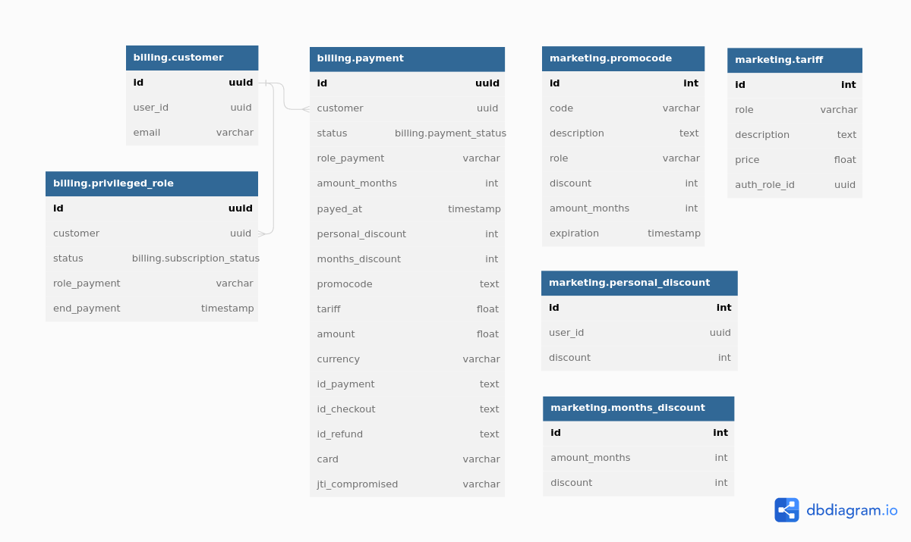

# Проектная работа: Биллинг
Репозиторий с работой [notifications_sprint_1](https://github.com/AlexeyBely/graduate_work)

Данный сервис решает две основные задачи:
1. Позволяет производить оплату за просмотр приоритетных фильмов.
2. Обеспечивает доступ отдела маркетинга к тарифам, скидкам, промо-кодам.
   
## Функциональные требования

1. Доступ к приоритетным фильмам осуществляется через роли (тарифы) пользователей.
2. Требования к тарифным планам:
    - тариф расчитывается с учетом персональной скидки пользователя;
    - тариф расчитывается с учетом скидки от количества месяцев;
    - промо-коды не привязаны к пользователю, общая скидка не суммируется;
    - возврат денежных средств возможен не более часа с момента оплаты;
    - после окончания тарифа предоставить доступ к фильмам в течении 2 дней
2. Предусмотреть хранилище для:
    - статуса оплаты пользователей;
    - скидок для каждого пользователя;
    - скидок от количества приобретенных месяцев;
    - промо-кодов;
    - тарифа приоритетных фильмов.
3. Cервис должен иметь API интерфейс, эндпоинты:
    - для выставления счета по выбранному тарифу; 
    - перенаправление в платежную систему для оплаты;
    - отмена оплаты и возврат денег до 1 часа с момента оплаты;
    - подтверждение оплаты;
    - информация об оплате пользователя.
4. Предусмотреть планировшик с функциями:
    - периодическая проверка оплаты (в отсутсвие подтверждения через API);
    - проверка окончания срока по тарифному плану.
5. Взаимодействие с сервисом нотификации:
    - сообщать об оплате тарифного плана;
    - сообщать об окончании тарифного плана;
    - сообщать об блокировки тарифного плана (после 2 дней окончания).
6. Предусмотреть админ-панель с функциями:
    - просмотр оплаты пользователей;
    - создание/изменение тарифного плана;
    - изменение стоимости тарифных планов;
    - просмотр/изменение скидки по каждому пользователю;
    - просмотр/изменение скидки от количества месяцев;
    - создание/удаление промо-кодов. 

## Системная архитектура
       


## Диаграмма последовательности оплаты
       


## Схема базы данных psql-billing
    



### Подготовка и запуск проекта

1. Задайте переменные окружения в файле `.env` в корне проекта (пример в файле `.env.sample`).
2. Запустите создание контейнеров с помощью команды:
```commandline
docker-compose up
```
3. Создайте таблицы базы данных и суперпользователя админ-панели. Для этого зайдите в приложение admin-notify
```commandline
docker exec -it admin-billing bash
```
Запуск миграций для создания таблиц БД
```commandline
python manage.py migrate
```
Создание суперпользователя
```commandline
python manage.py createsuperuser
```
Документацию по API можно найти по адресу [http://127.0.0.1/billing/api/openapi]()
    
Админ-панель доступна по адресу [http://127.0.0.1/admin-billing/]()

### Использованные технологии   
    
- FastAPI
- Django
- Celery
- RabbitMQ
- PSQL
- gRPC

### Над проектом работали
- Алексей Белоглазов [@AlexeyBely](https://github.com/AlexeyBely)