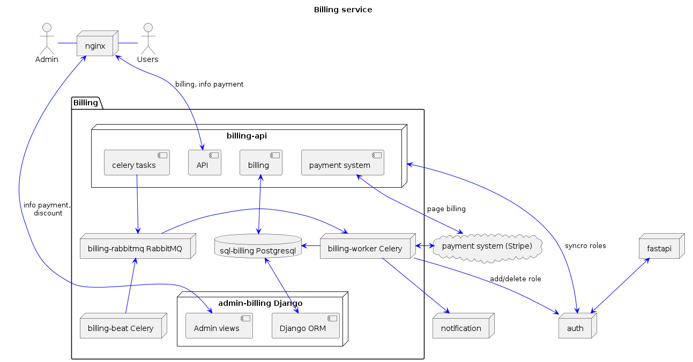
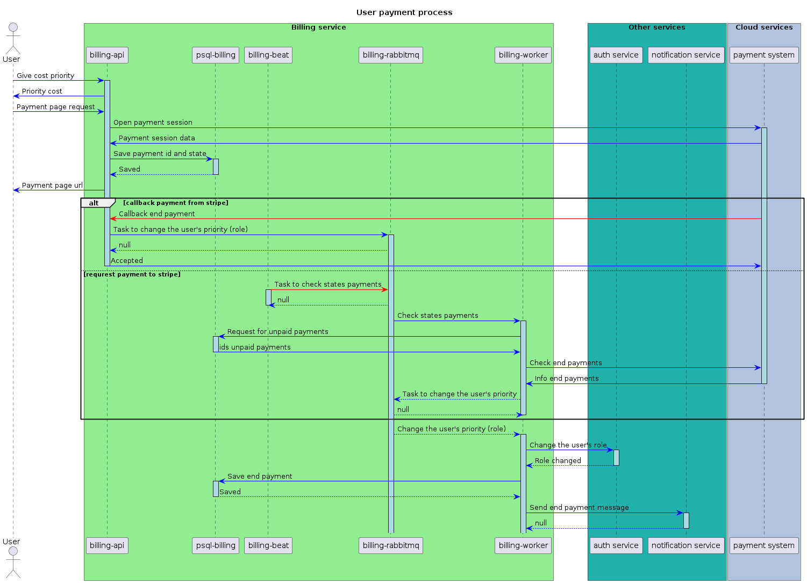

# Проектная работа: Биллинг

Данный сервис решает две основные задачи:
1. Позволяет производить оплату за просмотр приоритетных фильмов.
2. Обеспечивает доступ отдела маркетинга к тарифам, скидкам, промо-кодам.
   
## Функциональные требования

1. Доступ к приоритетным фильмам осуществляется через роли (тарифы) пользователей.
    Роли добавляет администратор в сервисе авторизации, и далее синхронизируются в сервис биллинга.
2. Требования к тарифным планам:
    - тариф расчитывается с учетом персональной скидки пользователя;
    - тариф расчитывается с учетом скидки от количества месяцев;
    - промо-коды не привязаны к пользователю, общая скидка не суммируется;
    - возврат денежных средств возможен не более часа с момента оплаты;
    - после окончания тарифа предоставить доступ к фильмам в течении 2 днех
2. Предусмотреть хранилище для:
    - статуса оплаты пользователей;
    - скидок для каждого пользователя;
    - скидок от количества приобретенных месяцев;
    - промо-кодов;
    - тарифа приоритетных фильмов.
3. Cервис должен иметь API интерфейс, эндпоинты:
    - для выставления счета по выбранному тарифу; 
    - перенаправление в платежную систему для оплаты;
    - отмена оплаты и возврат денег до 1 часа с момента оплаты;
    - подтверждение оплаты;
    - информация об оплате пользователя.
4. Предусмотреть планировшик с функциями:
    - периодическая проверка оплаты (в отсутсвие подтверждения через API);
    - проверка окончания срока по тарифному плану.
5. Взаимодействие с сервисом нотификации:
    - сообщать об оплате тарифного плана;
    - сообщать об окончании тарифного плана за 3 дня;
    - сообщать об окончании тарифного плана.
6. Предусмотреть админ-панель с функциями:
    - просмотр оплаты пользователей;
    - изменение тарифного плана пользователю;
    - изменение стоимости тарифных планов;
    - просмотр/изменение скидки по каждому пользователю;
    - просмотр/изменение скидки от количества месяцев;
    - создание/удаление промо-кодов. 

## Системная архитектура
       

## Диаграмма последовательности оплаты
       

## Схема базы данных psql-billing
    
    